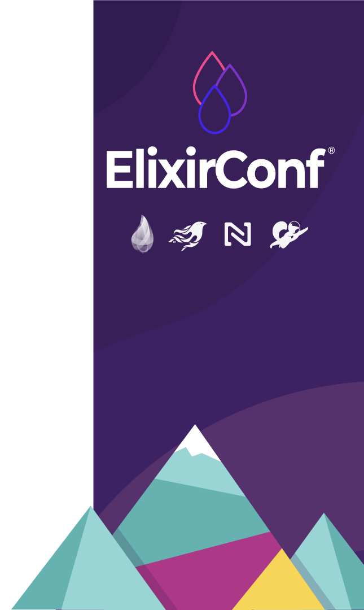

---

# Embedded Apps with LiveState
### Chris Nelson
LaunchScout

---

# What's an Embedded Application?
* Adds functionality to a larger application
* Examples
  * Live support
  * Buy button
  * Comments
  * Surveys

---

# Current state of the art
* Third party javascript
* Often `iframe` based
* Proprietary, limited customization

---

# There's a better way
* Custom Elements are here
* Supported by all the browsers
* Fully stylable with CSS
* The right tool for the job!

---

# Let's render LiveView in a Custom Element then!
* It's certainly *possible*
* I even got simple examples working
* But things get *really* complicated *really* fast
* In the end, it just didn't feel right (to me)

---

# What's LiveState?
* An elixir library (live_state)
* A javascript library (phx-live-state)
  * Note: not an official Phoenix thing!
  * I just stole the prefix cuz `live-state` npm was taken

---

# The basic ideas of LiveState
* Events
* State
* Reducers: functions which take
  * event
  * current state
  * return a new state

---

# Does this seem familiar?
* `GenServer`
* Redux
* LiveView

---

# Is there a name for this pattern?
* Event/State Reducers?
* Event Driven Thingamajig?
* Action Oriented Stuff?
* You know, the thing where you have functions that take event and current state and return a new state

---

# The new-ish idea
* Taking this pattern multi-tier
* No more request/reponse
* Dispatch events, receive state
  * and possibly other events

---

# Hot take! 
## It isn't javascript that makes client side development terrible
## It's the complexity of managing requests, responses, and distributed state

---

# How it works on the Client
* Client library uses Phoenix Channels
* Sends Custom Events over channel as `lvs:event_name`
* Receives `state:change` events to update local state
* Can optionally receive other events from channel and dispatch them

---

# How it works on the server
* Server use Phoenix Channels too :)
* state is maintained in a socket assign
* events are sent from client over the chanel
* state changes are pushed to client over the channel
* A `LiveState.Channel` behaviour makes things easy

---

## Mostly, I'm just using Phoenix Channels :)
You might be surprised how little code there is...

---

# `live_state`

* The elixir library
* Add it to your deps
* `use LiveState.Channel` behaviour in yo channel
* implement callbacks

---
## `init/3` to build initial state
  * Receives:
    * 
    * payload
    * 
  * `handle_event/3` to handle events
    * 
    * returns new state
    * optionally returns events to be dispatched on the client side
  * optional: `handle_message` for PubSub

---

# Let's make a ~~Todo List~~
Dear god no lets do something else plz

---

# Let's make something actually interesting: a live support thing
* A custom element that lets visitors chat with an agent
* Our "agents" will be in discord
* Make a new channel for each convo
* Relay messages to and from Discord

---

# Introducing `phx-live-state`
* javascript (typescript) npm
* increasing levels of abstraction:
  * `LiveState` - lower level API
  * `connectElement()` allows you to "wire up" a Custom Element
  * `@liveState` TS decorator lets you declaratively annotate a Custom Element

---

# The goal:
## Your TS/JS should only have to:
* declaratively connect to LiveState
* render UI
* dispatch events

---

# LiveState
* `new LiveState(url, channel)`
* `liveState.connect(params)` connects to socket and joins channel
* `liveState.subscribe((state) => {})` pass a function which will be called with new state
* `liveState.pushEvent(new CustomEvent('foo', {detail: ...})`) sends a custom event up to channel using detail as the payload 
  * `handle_event` will be called on channel to compute new state

---

##  `connectElement(element, liveState, options)`
* options:
  * properties - list of properties to set from state
  * attributes - list of attributes to set from state
  * events
    * send - events to send from this element
    * receive - events to receive and then dispatch on this element

---

# Let's make a Todo Element!

---

# More demos
* [Live comments](https://launchscout.github.io/test-livestate-comments/)
* Live commerce

---

# Future possible things
* Very soon:
  * jsonpatch for efficient state management
  * authorization hook and example
* Other clients
  * Swift/iOS
  * Kotlin/Android
  * React
* Connecting to FAAS

---

# It's early times!
* APIs may still change
* It's great time to join us if you want to help them be better :)
* If you are building an embedded or micro front end app, let's talk
  * chris@launchscout.com
